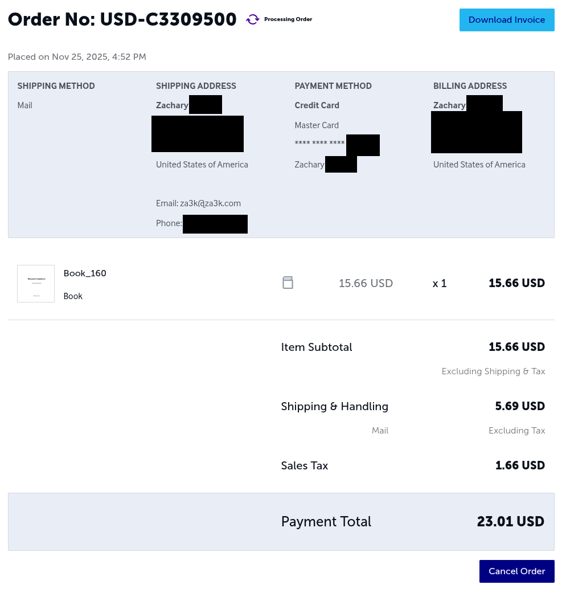

[Hack-a-Day](https://za3k.com/hackaday) is my self-imposed challenge to do one project a day, for all of November.

Written by [Claude](https://claude.ai) and [za3k](https://za3k.com)

This is a command-line program which takes a PDF, and publishes it, sending it to your house, and pays for it with your credit card.

Copy `env-sample` to `.env` and edit it to add personal info. You will need to make a [lulu.com](https://www.lulu.com) account to use the program.

Usage:

    uv run lulu_automation.py /path/to/your/book.pdf

`uv` reads the dependency list from the top of the script and installs it for
you. Playwright needs a browser too, once:

    uv run --with playwright playwright install chromium

Without `uv`, `pip install -r requirements.txt` and `python lulu_automation.py`
still work.

Lulu supports only specific sizes for pages -- most standard page sizes are OK.

The cover is auto-generated for you, using the title and author provided in `.env`.

